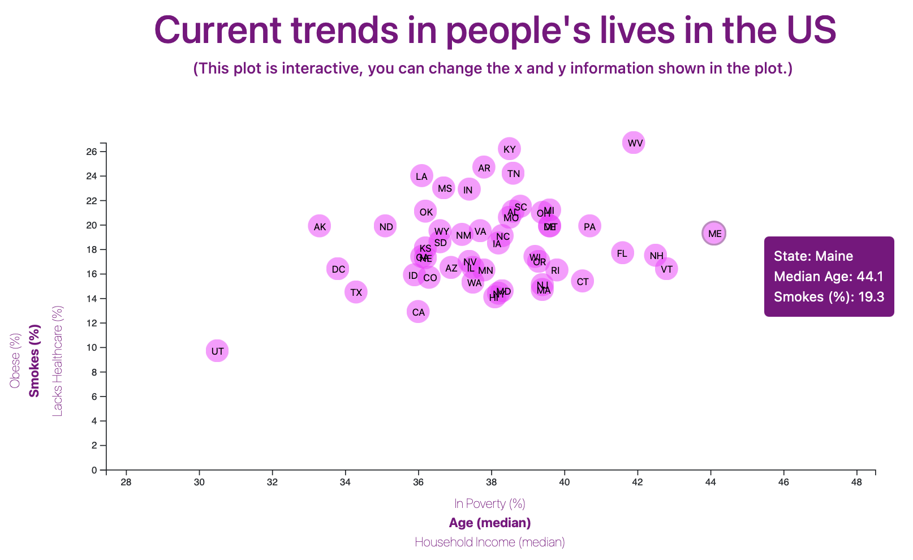
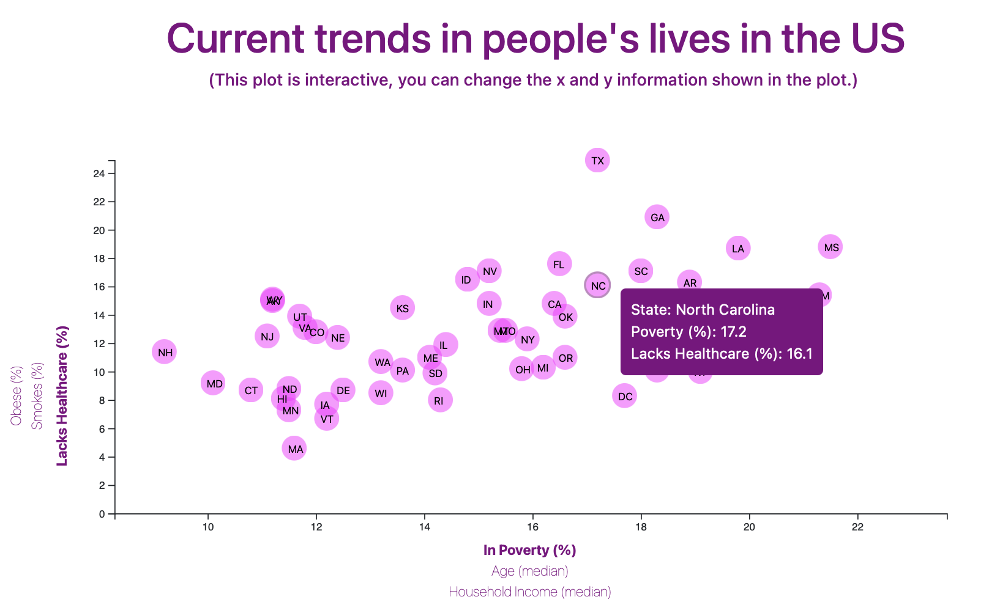

# D3-challenge
---
16 Data Journalism and D3

* Project using D3 to visualise the health risks facing a particular demographics using information from the U.S. Census Bureau and the Behavioral Risk Factor Surveillance System.
* Creating a dynamic visualisation using a scatter plot. 
* The information changes depending on the x and y values that are chosen. The pop-up information changes accordingly.

